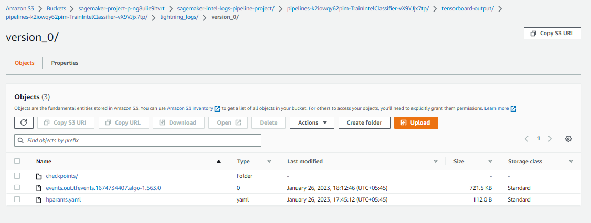

## 3. Complete SageMaker pipeline
Made a complete sagemaker pipeline for fetch data -> preprocess -> Train -> Eval -> Register Model(Conditional)
Parameters to pipeline are:
* Model
* Batch Size
* Optimizer
* Learning Rate
* Train Dataset Location in S3
* Test Dataset Location in S3

Six different augmentations are used as:
```python
            T.RandomRotation(degrees=66),
            T.RandomHorizontalFlip(p=0.5),
            T.ColorJitter(brightness=(0.1, 0.6), contrast=1, saturation=0, hue=0.4),
            T.GaussianBlur(kernel_size=(5, 9), sigma=(0.1, 5)),
            T.Resize((224, 224)),
            T.RandomCrop(size=(128, 128)),
```


### 4. Model Evaluation and Model Robustness

Model Robustness:


Model Accuracy in test set: `90%`

Evaluation logs found: 

Hyperparameters of model are:
```
lr: 3.5999257898500047e-05
model_name: resnet18
num_classes: 6
optim_name: RMS # ~ torch.optim.RMSProp()
```

**Logs**
```bash
$ tensorboard dev upload --logdir logs --name "Sagmaker Pipeline - Logs" \
                          --description " Logging of different metrics, training on best hparams"
```
Tensoboard Dev Link: https://tensorboard.dev/experiment/1qsRwgwJQPK3NgCOSv55Mg/#scalars


**ConfusionMatrix**
I attached the recorded gif for confusion matrix images, as tensorboard dev not support images. 

Full logs is available here in gdrive: 


**Model Evaluation**
```json
{"multiclass_classification_metrics": {"accuracy": {"value": 0.9056666493415833, "standard_deviation": "0"}, "confusion_matrix": {"buildings": 24.94279146194458, "forest": 33.122363686561584, "glacier": 31.28390610218048, "mountain": 28.57142984867096, "sea": 31.568628549575806, "street": 31.736525893211365}}}
```
**Training Logs S3 screenshot**


**Hparams Yaml**
```yaml
learning_rate: 1.2e-05
lr: 1.2e-05
model_name: regnetz_c16
num_classes: 6
optimizer_name: ADAM

```